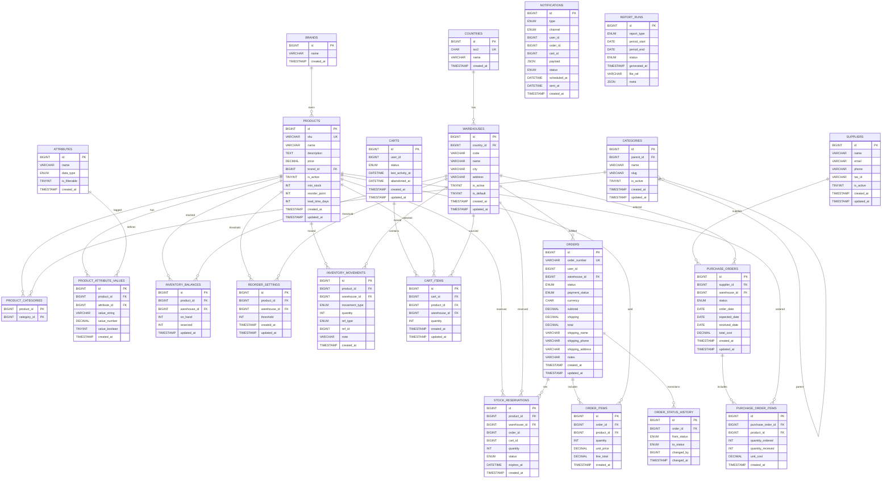

# Diagrama ER v2 (Theonova)

```mermaid
erDiagram
    COUNTRIES ||--o{ WAREHOUSES : has
    BRANDS ||--o{ PRODUCTS : owns
    CATEGORIES ||--o{ CATEGORIES : parent
    PRODUCTS ||--o{ PRODUCT_CATEGORIES : tagged
    CATEGORIES ||--o{ PRODUCT_CATEGORIES : categorizes
    PRODUCTS ||--o{ PRODUCT_ATTRIBUTE_VALUES : has
    ATTRIBUTES ||--o{ PRODUCT_ATTRIBUTE_VALUES : defines
    PRODUCTS ||--o{ INVENTORY_BALANCES : stocked
    WAREHOUSES ||--o{ INVENTORY_BALANCES : stores
    PRODUCTS ||--o{ REORDER_SETTINGS : threshold
    WAREHOUSES ||--o{ REORDER_SETTINGS : threshold
    PRODUCTS ||--o{ INVENTORY_MOVEMENTS : moved
    WAREHOUSES ||--o{ INVENTORY_MOVEMENTS : moved
    PRODUCTS ||--o{ STOCK_RESERVATIONS : reserved
    WAREHOUSES ||--o{ STOCK_RESERVATIONS : reserved
    CARTS ||--o{ CART_ITEMS : contains
    PRODUCTS ||--o{ CART_ITEMS : selected
    WAREHOUSES ||--o{ CART_ITEMS : sourced
    WAREHOUSES ||--o{ ORDERS : fulfilled
    ORDERS ||--o{ ORDER_ITEMS : includes
    PRODUCTS ||--o{ ORDER_ITEMS : sold
    ORDERS ||--o{ ORDER_STATUS_HISTORY : transitions
    ORDERS ||--o{ STOCK_RESERVATIONS : ties
    SUPPLIERS ||--o{ PURCHASE_ORDERS : supplies
    WAREHOUSES ||--o{ PURCHASE_ORDERS : ordered
    PURCHASE_ORDERS ||--o{ PURCHASE_ORDER_ITEMS : includes
    PRODUCTS ||--o{ PURCHASE_ORDER_ITEMS : ordered

    COUNTRIES {
        BIGINT id PK
        CHAR iso2 UK
        VARCHAR name
        TIMESTAMP created_at
    }
    WAREHOUSES {
        BIGINT id PK
        BIGINT country_id FK
        VARCHAR code
        VARCHAR name
        VARCHAR city
        VARCHAR address
        TINYINT is_active
        TINYINT is_default
        TIMESTAMP created_at
        TIMESTAMP updated_at
    }
    BRANDS {
        BIGINT id PK
        VARCHAR name
        TIMESTAMP created_at
    }
    CATEGORIES {
        BIGINT id PK
        BIGINT parent_id FK
        VARCHAR name
        VARCHAR slug
        TINYINT is_active
        TIMESTAMP created_at
        TIMESTAMP updated_at
    }
    PRODUCTS {
        BIGINT id PK
        VARCHAR sku UK
        VARCHAR name
        TEXT description
        DECIMAL price
        BIGINT brand_id FK
        TINYINT is_active
        INT min_stock
        INT reorder_point
        INT lead_time_days
        TIMESTAMP created_at
        TIMESTAMP updated_at
    }
    PRODUCT_CATEGORIES {
        BIGINT product_id PK
        BIGINT category_id PK
    }
    ATTRIBUTES {
        BIGINT id PK
        VARCHAR name
        ENUM data_type
        TINYINT is_filterable
        TIMESTAMP created_at
    }
    PRODUCT_ATTRIBUTE_VALUES {
        BIGINT id PK
        BIGINT product_id FK
        BIGINT attribute_id FK
        VARCHAR value_string
        DECIMAL value_number
        TINYINT value_boolean
        TIMESTAMP created_at
    }
    INVENTORY_BALANCES {
        BIGINT id PK
        BIGINT product_id FK
        BIGINT warehouse_id FK
        INT on_hand
        INT reserved
        TIMESTAMP updated_at
    }
    REORDER_SETTINGS {
        BIGINT id PK
        BIGINT product_id FK
        BIGINT warehouse_id FK
        INT threshold
        TIMESTAMP created_at
        TIMESTAMP updated_at
    }
    INVENTORY_MOVEMENTS {
        BIGINT id PK
        BIGINT product_id FK
        BIGINT warehouse_id FK
        ENUM movement_type
        INT quantity
        ENUM ref_type
        BIGINT ref_id
        VARCHAR note
        TIMESTAMP created_at
    }
    STOCK_RESERVATIONS {
        BIGINT id PK
        BIGINT product_id FK
        BIGINT warehouse_id FK
        BIGINT order_id
        BIGINT cart_id
        INT quantity
        ENUM status
        DATETIME expires_at
        TIMESTAMP created_at
    }
    CARTS {
        BIGINT id PK
        BIGINT user_id
        ENUM status
        DATETIME last_activity_at
        DATETIME abandoned_at
        TIMESTAMP created_at
        TIMESTAMP updated_at
    }
    CART_ITEMS {
        BIGINT id PK
        BIGINT cart_id FK
        BIGINT product_id FK
        BIGINT warehouse_id FK
        INT quantity
        TIMESTAMP created_at
        TIMESTAMP updated_at
    }
    ORDERS {
        BIGINT id PK
        VARCHAR order_number UK
        BIGINT user_id
        BIGINT warehouse_id FK
        ENUM status
        ENUM payment_status
        CHAR currency
        DECIMAL subtotal
        DECIMAL shipping
        DECIMAL total
        VARCHAR shipping_name
        VARCHAR shipping_phone
        VARCHAR shipping_address
        VARCHAR notes
        TIMESTAMP created_at
        TIMESTAMP updated_at
    }
    ORDER_ITEMS {
        BIGINT id PK
        BIGINT order_id FK
        BIGINT product_id FK
        INT quantity
        DECIMAL unit_price
        DECIMAL line_total
        TIMESTAMP created_at
    }
    ORDER_STATUS_HISTORY {
        BIGINT id PK
        BIGINT order_id FK
        ENUM from_status
        ENUM to_status
        BIGINT changed_by
        TIMESTAMP changed_at
    }
    NOTIFICATIONS {
        BIGINT id PK
        ENUM type
        ENUM channel
        BIGINT user_id
        BIGINT order_id
        BIGINT cart_id
        JSON payload
        ENUM status
        DATETIME scheduled_at
        DATETIME sent_at
        TIMESTAMP created_at
    }
    SUPPLIERS {
        BIGINT id PK
        VARCHAR name
        VARCHAR email
        VARCHAR phone
        VARCHAR tax_id
        TINYINT is_active
        TIMESTAMP created_at
        TIMESTAMP updated_at
    }
    PURCHASE_ORDERS {
        BIGINT id PK
        BIGINT supplier_id FK
        BIGINT warehouse_id FK
        ENUM status
        DATE order_date
        DATE expected_date
        DATE received_date
        DECIMAL total_cost
        TIMESTAMP created_at
        TIMESTAMP updated_at
    }
    PURCHASE_ORDER_ITEMS {
        BIGINT id PK
        BIGINT purchase_order_id FK
        BIGINT product_id FK
        INT quantity_ordered
        INT quantity_received
        DECIMAL unit_cost
        TIMESTAMP created_at
    }
    REPORT_RUNS {
        BIGINT id PK
        ENUM report_type
        DATE period_start
        DATE period_end
        ENUM status
        TIMESTAMP generated_at
        VARCHAR file_ref
        JSON meta
    }
```
